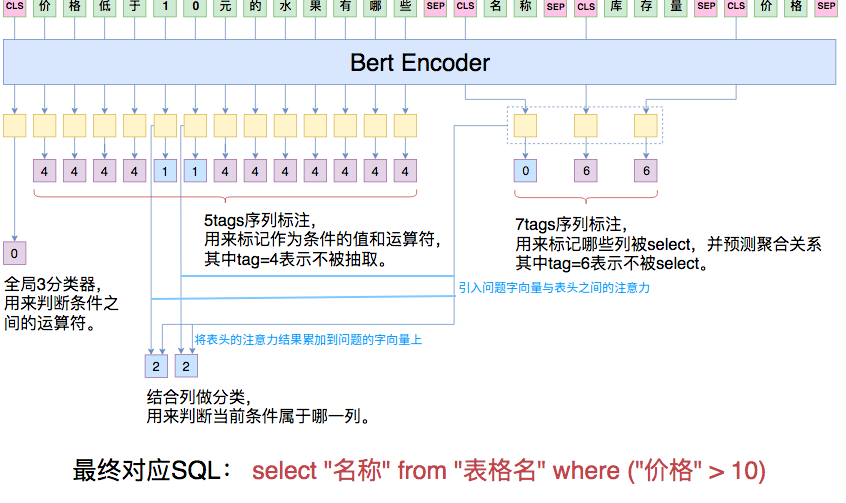

## Part0: 参赛人员信息
- 姓名: 殷帅
- 毕业院校: 北京邮电大学
- 平台昵称: yscoder 
- 参赛形式: 个人
- 目前名词: 31
- 目前成绩: 0.7293


## Part1:  代码环境
--- 
### 环境配置步骤如下: 

--- 
#### 1. 深度学习相关环境

配置详情
- 显卡: 1080ti
- OS: Ubuntu
- Driver Version: 418.56       
- CUDA Version: 10.1    
- CUDNN Version: 10.1 

安装步骤
1. 安装nvidia-driver 
    sudo sh ./software/NVIDIA-Linux-x86_64-418.56.run
2. 安装cuda10.1 
    sudo sh ./software/cuda_10.1.168_418.67_linux.run  
    注意无需再安装driver,因为第一步已经手工安装

3. 安装cudnn10.1


---
#### 2. Python相关环境

``` shell 
conda create --name nl2sql-yscoder python=3.6
source activate
conda activate nl2sql-yscoder
pip install -i https://pypi.tuna.tsinghua.edu.cn/simple  -r ./code/requirements.txt
``` 
root@481c7f8087a2

执行训练任务(训练入口):
``` 
bash start_train.sh
```
执行推理任务(推理入口):
``` 
bash start_test.sh
```

#### 3.  模型信息
  - Bert中文预训练模型(哈工大版) ,该模型存储位置:  ./submit/chinese-bert_chinese_wwm_L-12_H-768_A-12   
  - Bert-finetune模型,该模型为经过finetune之后的，适配于当前nl2sql任务的训练模型, 该模型存储路径 ./submit/nl2sql_finetune.weights

#### 4. 关于随机种子问题 
 test结果在提交评测时，**未设置随机种子**，故劳烦主办方采用既定方案进行评测

--- 

## Part2: 预处理
--- 
###  一. 数值类型转化

   　官方提供的数据集中考虑到用户输入的多样性，所以question包含了各种展现形式的数值类型．模型处理时首先对question进行了格式统一,具体如下: 
   1. 百分数转换，例如**百分之10**转化为**10%**,**百分之十**转换为**10%**, 百分之一点五转化为**1.5%**  

   2. 大写数字转阿拉伯数字，例如**十二**转换为**12**; **二十万**转化为**200000**; 一点二转化为**1.2** 
   3. 年份转换，如将12年转换为2012年

   数值类型转换过程当中用到了大量正则匹配，主要匹配出数字可能出现的位置,以利于后续对**训练集**做标记.  
   具体代码位置: **question_prepro.py**    
   功能汇总函数: **trans_question_acc**


--- 
### 二. 训练集数据清洗与分类 
训练数据集当中存在部分数据标注错误，例如12标注为了13,为了使得后续训练的时候更加精确，通过简单规则将一些数据模式匹配出来.  
    主要将问题分成几种模式,以便于正确的标记.主要模式如下:   
   1. 标注数据的所有条件值在question中出现，且出现的次数为1
   2. 条件值为非数字,而且通过相似度函数可以在question中找到的
   3. 条件值出现在问题中并且出现的次数大于1,　表的列名出现在question中并且出现的次数为1  
   ...  

   具体代码文件:  mark_acc_ensure.py     check_input_feature.py     
   Todo:   
      更多的提升其实还是对训练集中的几种模式的正确区分，但是时间和人力关系，识别出的模式并不多.并且上述规则略微粗糙，导致少量数据归类错误，这会给bert的学习带来困惑


--- 

## Part3:模型介绍
本方案主要改写自苏神提供的大赛baseline https://spaces.ac.cn/archives/6771 本次提交的模型主要对**条件值对应的列部分做了重写.** 


模型结构图如下: 



**重写**了关于csel部分的预测，计算问题中字向量与表头的注意力，并将表头的注意力结果累加(非拼接)到问题的字向量中,后面再接一个dense(csel_num)来预测所属的列.　代码如下: 
 ``` python 
 csel_num = 20 # col cnt 最大为20 

x_ori = x
x = Lambda(lambda x: K.expand_dims(x, 2))(x) #  shape [batch_size, n_step, 1, hidden_size]
x4h_ori  = x4h
x4h = Lambda(lambda x: K.expand_dims(x, 1))(x4h) # header cls selected in x4h  [None, 1, header_n_step, hidden_size ]
pcsel_1 = Dense(1)(x) # [None, q_n_step, 1 ,1]
pcsel_2 = Dense(1)(x4h) # [None, 1, h_n_step, 1 ]
pcsel_att = Lambda(lambda x: x[0] * x[1])([pcsel_1, pcsel_2]) # [None, q_n_step, h_n_step,1]
pcsel_att = Lambda(lambda x: x[..., 0])(pcsel_att) # [None,q_n_step，h_n_step]
#x4h_ori  [None, h_n_step，hidden_size】
pcsel_h_part = Lambda(lambda x: K.batch_dot(x[0], x[1]))([pcsel_att, x4h_ori]) # [None, q_n_step, hidden_siz]    
#pcsel = Lambda(lambda x: K.batch_dot(x[0], x[1]))([att_val, x4h_ori]) # [None, q_n_step, hidden_size]
pcsel = Lambda(lambda x: x[0] + x[1])([x_ori, pcsel_h_part]) # [None, q_n_step, hidden]
pcsel = Dense(csel_num, activation='softmax')(pcsel) # [bs, q_step, num_op]
```


模型预测值的可选空间如下: 
``` python 
        num_agg = 7 # agg_sql_dict = {0:"", 1:"AVG", 2:"MAX", 3:"MIN", 4:"COUNT", 5:"SUM", 6:"不被select"}
        num_op = 5 # {0:">", 1:"<", 2:"==", 3:"!=", 4:"不被select"}
        num_cond_conn_op = 3 # conn_sql_dict = {0:"", 1:"and", 2:"or"}
        csel_num = 20 # 条件值对应的列编号 最大为20 
``` 
   模型描述: 
  - 将question句子连同数据表的所有表头拼起来，一同输入到Bert模型中进行实时编码，其中每一个表头也视为一个句子，用[CLS]***[SEP]括住。经过Bert之后，得到了一系列编码向量.
  - [CLS]对应的向量，作为整个问题的句向量，用来预测conds的连接符。
  - 表头前的每个[CLS]作为每个表头的编码向量，用来预测该列是否被select，以及如果被select,其对应的agg是什么.
  - 条件值运算符的预测,作为一个序列标注问题，条件值的运算符一共有4个，通过新增一类变为5类，第5类表示当前字不被标注．　
  - 条件值所在的列的预测. 计算question中值的字向量与表头向量的**注意力**，并将注意力结果**累加**到**question的字向量中**, 然后后接Dense(1)来对条件值所在的列进行预测.条件值对应的列编号最大为20,而且编号0表示该字与任意表头无关.

　　
> 注意，如果执行此代码报错，需要修改一下Keras的backend/tensorflow_backend.py，将sparse_categorical_crossentropy函数中原本是  

``` python 
   logits = tf.reshape(output, [-1, int(output_shape[-1])]) 
``` 
的那一行改为
``` python 
logits = tf.reshape(output, [-1, tf.shape(output)[-1]])
``` 

--- 
## Part4: 后处理    
   后处理主要包括如下几块:
   1. 数字中的部分**数位缺失**,例如**200000** 模型之预测到**200**,根据数字的性质，可以对缺失的数位做补齐处理
   2. question中数值单位和表中单位进行统一. 例如question当中票房的单位是"亿",而在相关表中该列的单位为"百万". 本数据集中数值相关的单位存储在表的列名称或者表的title中.
   
   代码文件: post_treat.py 


--- 

## Part5: 模型效果评估  
模型效果评估部分，主要采用官方baseline中的方法，并进行了一定封装．主要用于对预测各个部件的准确性进行评估，并存储预测的错误结果以用于后续分析.    
功能所在文件为calc_acc.py   
主要函数为check_part_acc


--- 
## Part6: TODO 
#### 目前暂时无法匹配的模式:   
 AB连续型，一词多列型

 一词多列型如下:
 > 你知道注册区县为静海区或者申请类别属于股改补助或者补助金额为20万元的企业全称吗   
 呃，可以告诉我现在都有哪些公司12年和13年的市盈率估值都小于10吗   
 哪些公司总地和建筑面积都在10以上的，而且都是在哪里有的   
 
 后续可以尝试对csel部分的字向量做拆分与重组来使其能正确表征更多表头

**AB连续型**考虑通过csel部分将两个连续实体区分到不同的表头上去


另外一些相似词无法正确匹配出来，如下: 
> 一共有几款手机游戏是企鹅公司做的？  
买一本初一的欢乐寒假要花多少钱？

其中"企鹅"是和"腾讯"是同义词;"初一"和"七年级"是同义词，当前模型暂时无法将二者关联起来，但是后续可以考虑引入**同义词库**或者采用**语义相似度**进行匹配


#### 复赛环境配置

#### 几点可以改进的方向
- 如何设计loss函数
- 如何使得训练加快
- concate() 这个东西怎么加上
- cdiv的设计
- 如何优化loss 
- loss损失率的设置
- csel start from 0 or 1 
- 如何提高收敛速度
- bert后添加多个个dense层合适，各个dense层如何添加激活函数来避免梯度爆炸


Sel-Num: 0.038, Sel-Col: 0.056, Sel-Agg: 0.049, W-Num: 0.119, W-Col: 0.060, W-Op: 0.026, W-Val: 0.069, W-Rel: 0.101, total_err: 0.248
 Acc in evaluate data set is 0.7515923566878981


 ]Sel-Num: 0.027, Sel-Col: 0.052, Sel-Agg: 0.039, W-Num: 0.102, W-Col: 0.051, W-Op: 0.020, W-Val: 0.062, W-Rel: 0.084, total_err: 0.220
 Acc in evaluate data set is 0.7797998180163785


 ## Part0: 参赛人员信息
- 姓名: 殷帅
- 毕业院校: 北京邮电大学
- 平台昵称: yscoder 
- 参赛形式: 个人
- 目前名词: 31
- 目前成绩: 0.7293
## Part1:代码环境
--- 
### 环境配置步骤如下: 
--- 
#### 1. 深度学习相关环境
配置详情
- 显卡: 1080ti
- OS: Ubuntu
- Driver Version: 418.56 
- CUDA Version: 10.1
- CUDNN Version: 10.1 
安装步骤
1. 安装nvidia-driver 
sudo sh ./software/NVIDIA-Linux-x86_64-418.56.run
2. 安装cuda10.1 
sudo sh ./software/cuda_10.1.168_418.67_linux.run
注意无需再安装driver,因为第一步已经手工安装
3. 安装cudnn10.1
---
#### 2. Python相关环境
``` shell 
conda create --name nl2sql-yscoder python=3.6
conda activate nl2sql-yscoder
pip install -i https://pypi.tuna.tsinghua.edu.cn/simple-r ./code/requirements.txt
``` 
执行训练任务(训练入口):
``` 
bash start_train.sh
```
执行推理任务(推理入口):
``` 
bash start_test.sh
```
#### 3.模型信息
- Bert中文预训练模型(哈工大版) ,该模型存储位置:./submit/chinese-bert_chinese_wwm_L-12_H-768_A-12 
- Bert-finetune模型,该模型为经过finetune之后的，适配于当前nl2sql任务的训练模型, 该模型存储路径 ./submit/nl2sql_finetune.weights
#### 4. 关于随机种子问题 
test结果在提交评测时，**未设置随机种子**，故劳烦主办方采用既定方案进行评测
--- 
## Part2: 预处理
--- 
###一. 数值类型转化
　官方提供的数据集中考虑到用户输入的多样性，所以question包含了各种展现形式的数值类型．模型处理时首先对question进行了格式统一,具体如下: 
1. 百分数转换，例如**百分之10**转化为**10%**,**百分之十**转换为**10%**, 百分之一点五转化为**1.5%**
2. 大写数字转阿拉伯数字，例如**十二**转换为**12**; **二十万**转化为**200000**; 一点二转化为**1.2** 
3. 年份转换，如将12年转换为2012年
数值类型转换过程当中用到了大量正则匹配，主要匹配出数字可能出现的位置,以利于后续对**训练集**做标记.
具体代码位置: **question_prepro.py**
功能汇总函数: **trans_question_acc**
--- 
### 二. 训练集数据清洗与分类 
训练数据集当中存在部分数据标注错误，例如12标注为了13,为了使得后续训练的时候更加精确，通过简单规则将一些数据模式匹配出来.
主要将问题分成几种模式,以便于正确的标记.主要模式如下: 
1. 标注数据的所有条件值在question中出现，且出现的次数为1
2. 条件值为非数字,而且通过相似度函数可以在question中找到的
3. 条件值出现在问题中并且出现的次数大于1,　表的列名出现在question中并且出现的次数为1
...
具体代码文件:mark_acc_ensure.py check_input_feature.py 
Todo: 
更多的提升其实还是对训练集中的几种模式的正确区分，但是时间和人力关系，识别出的模式并不多.并且上述规则略微粗糙，导致少量数据归类错误，这会给bert的学习带来困惑
--- 
## Part3:模型介绍
本方案主要改写自苏神提供的大赛baseline https://spaces.ac.cn/archives/6771 本次提交的模型主要对**条件值对应的列部分做了重写.** 
模型结构图如下: 

**重写**了关于csel部分的预测，计算问题中字向量与表头的注意力，并将表头的注意力结果累加(非拼接)到问题的字向量中,后面再接一个dense(csel_num)来预测所属的列.　代码如下: 
``` python 
csel_num = 20 # col cnt 最大为20 
x_ori = x
x = Lambda(lambda x: K.expand_dims(x, 2))(x) #shape [batch_size, n_step, 1, hidden_size]
x4h_ori= x4h
x4h = Lambda(lambda x: K.expand_dims(x, 1))(x4h) # header cls selected in x4h[None, 1, header_n_step, hidden_size ]
pcsel_1 = Dense(1)(x) # [None, q_n_step, 1 ,1]
pcsel_2 = Dense(1)(x4h) # [None, 1, h_n_step, 1 ]
pcsel_att = Lambda(lambda x: x[0] * x[1])([pcsel_1, pcsel_2]) # [None, q_n_step, h_n_step,1]
pcsel_att = Lambda(lambda x: x[..., 0])(pcsel_att) # [None,q_n_step，h_n_step]
#x4h_ori[None, h_n_step，hidden_size】
pcsel_h_part = Lambda(lambda x: K.batch_dot(x[0], x[1]))([pcsel_att, x4h_ori]) # [None, q_n_step, hidden_siz]
#pcsel = Lambda(lambda x: K.batch_dot(x[0], x[1]))([att_val, x4h_ori]) # [None, q_n_step, hidden_size]
pcsel = Lambda(lambda x: x[0] + x[1])([x_ori, pcsel_h_part]) # [None, q_n_step, hidden]
pcsel = Dense(csel_num, activation='softmax')(pcsel) # [bs, q_step, num_op]
```
模型预测值的可选空间如下: 
``` python 
num_agg = 7 # agg_sql_dict = {0:"", 1:"AVG", 2:"MAX", 3:"MIN", 4:"COUNT", 5:"SUM", 6:"不被select"}
num_op = 5 # {0:">", 1:"<", 2:"==", 3:"!=", 4:"不被select"}
num_cond_conn_op = 3 # conn_sql_dict = {0:"", 1:"and", 2:"or"}
csel_num = 20 # 条件值对应的列编号 最大为20 
``` 
模型描述: 
- 将question句子连同数据表的所有表头拼起来，一同输入到Bert模型中进行实时编码，其中每一个表头也视为一个句子，用[CLS]***[SEP]括住。经过Bert之后，得到了一系列编码向量.
- [CLS]对应的向量，作为整个问题的句向量，用来预测conds的连接符。
- 表头前的每个[CLS]作为每个表头的编码向量，用来预测该列是否被select，以及如果被select,其对应的agg是什么.
- 条件值运算符的预测,作为一个序列标注问题，条件值的运算符一共有4个，通过新增一类变为5类，第5类表示当前字不被标注．　
- 条件值所在的列的预测. 计算question中值的字向量与表头向量的**注意力**，并将注意力结果**累加**到**question的字向量中**, 然后后接Dense(1)来对条件值所在的列进行预测.条件值对应的列编号最大为20,而且编号0表示该字与任意表头无关.
　　
> 注意，如果执行此代码报错，需要修改一下Keras的backend/tensorflow_backend.py，将sparse_categorical_crossentropy函数中原本是
``` python 
logits = tf.reshape(output, [-1, int(output_shape[-1])]) 
``` 
的那一行改为
``` python 
logits = tf.reshape(output, [-1, tf.shape(output)[-1]])
``` 
--- 
## Part4: 后处理
后处理主要包括如下几块:
1. 数字中的部分**数位缺失**,例如**200000** 模型之预测到**200**,根据数字的性质，可以对缺失的数位做补齐处理
2. question中数值单位和表中单位进行统一. 例如question当中票房的单位是"亿",而在相关表中该列的单位为"百万". 本数据集中数值相关的单位存储在表的列名称或者表的title中.

代码文件: post_treat.py 
--- 
## Part5: 模型效果评估
模型效果评估部分，主要采用官方baseline中的方法，并进行了一定封装．主要用于对预测各个部件的准确性进行评估，并存储预测的错误结果以用于后续分析.
功能所在文件为calc_acc.py 
主要函数为check_part_acc
--- 
## Part6: TODO 
#### 目前暂时无法匹配的模式: 
AB连续型，一词多列型
一词多列型如下:
> 你知道注册区县为静海区或者申请类别属于股改补助或者补助金额为20万元的企业全称吗 
呃，可以告诉我现在都有哪些公司12年和13年的市盈率估值都小于10吗 
哪些公司总地和建筑面积都在10以上的，而且都是在哪里有的 

后续可以尝试对csel部分的字向量做拆分与重组来使其能正确表征更多表头
**AB连续型**考虑通过csel部分将两个连续实体区分到不同的表头上去
另外一些相似词无法正确匹配出来，如下: 
> 一共有几款手机游戏是企鹅公司做的？
买一本初一的欢乐寒假要花多少钱？
其中"企鹅"是和"腾讯"是同义词;"初一"和"七年级"是同义词，当前模型暂时无法将二者关联起来，但是后续可以考虑引入**同义词库**或者采用**语义相似度**进行匹配
有几个地方需要注意的: 


### Part7: 重点思路
分类，能够多细分就多细分: 
- 完全正确的
  - 条件如下: 
     - 所有的条件之必须在q中出现过，而且出现的次数必须等于1, 
     - 在conds中不能出现条件值相同(排除那些一词对应多列的情况)
     - 标记出来的值不能重合

  - 文件位置
     - new_q_correct


- 文本可以通过most_similar匹配上
  - 条件如下: 
     - 条件值均为文本
     - 条件值不在q中，但是通过most_sim可以标记出来 
     - 标记出来的值不能重合
  - 函数
     - get_no_num_similar
  - 文件: 
     - new_q_no_num_similar


- 一值多列型 (注意: 定位不许直接用index)
  - 条件如下
     - 条件值中一词对应多个列的，而且条件值**只出现一次** 
     - 条件值在cond中也是只出现一次
     - 值要全匹配，或者部分匹配(可以多点0)

        - col_in_q_digit_path_fh
        - val为"real", val出现在问题里面并且出现的次数大于1 
        - col_name需要在question中
        - col_name不能在question中出现多次,只能一次
        - 
  - 函数
     - q_one_vs_more_col
  - 文件
     - new_q_one_vs_more_col.log 
  - typeical 
      - 有几家公司的路产收入占比和路产毛利占比大于80%以及路产毛利率大于60%

- 数字出现多次，但是可以通过数字精准匹配 (注意: 定位不许直接用index)
   - 条件如下
   - 


   - 函数:
       - q_need_exactly_match


- 数值匹配多次但是可以通过是否全匹配区分
  - 条件如下: 
     - 条件值在conds中不存在重复(不能使一词多列等)
     - 条件值均为数字
     - 条件值在q中出现
  - 例子
     - 20不能标记到2011身上


- 这个csel标记补全!!!
[[1, 0, '6000'], [2, 0, '20']]
今年第四周的票房超过60000000，票房的占比也达到20%以上的影片共有多少部呀


### 额外辅助思路


# most_similar_2 函数有很多缺陷
- 19年1月7日到13日周票房超过10000000的影投公司是哪家 
cond = [1, 0, '1000'] 
most_similar_2res = 1000 
需要手工补全数字
- 一些None的情况
请你帮我查一下有几家公司的市值是不超过百亿元的啊？ 
cond = [4, 1, '100'] 
most_similar_2res = None
- 很多index位置标记错了,尤其是数比较小的,跟日期
    - 一共有几家公司预计在11年和12年每股收益都超过1的[2, 0, '1']
    - 预计在2011年，还有2012年每股的盈余都在1以上的公司有多少个
    - 有多少家企业11年和12年预计每股税后利润都高于1
    - 请问在6月17日最新股价超过1并且最新市值达到20亿港币的证券都有哪些？
    - 请问这个星期销售超过300且上星期超过300的去年同期平均是多少？
    - 09年高点大于500并且10年高点大于500并且11年高点大于500的城市有哪些？
    - 有哪些城市09年高点大于500并且10年高点大于500并且11年高点大于500的？
    - 请问一下，有哪些城市09年高点大于500并且10年高点大于500并且11年高点大于500的？
    - 哪些机场的起降航班数17冬春大于10000以及夏秋大于10000
    - 那个2011年每股盈余大于1元的都是什么股啊，其代码是什么啊
    - 我想知道就是哪些股11年的每股收益超过1块的，那股票代码是什么啊
    - 内资PCB龙头企业2014大于10亿元并且2015年大于10亿元的公司有哪些？
    - 有哪些内资PCB龙头企业2014大于10亿元并且2015年大于10亿元的公司？
    - 请问一下内资PCB龙头企业2014大于10亿元并且2015年大于10亿元的公司有哪些？
    - EPS2019E大于0.5并且EPS2020E大于0.5的收盘价最少是多少？(0.5标记了到了一个位置)
    - 有哪些证券17年每股收益大于0.4元而且预计18年也超过0.4元？
    - 截止到18年11月16日为止，预估在18年每股盈余多于4毛钱，并且在17年时是已在4毛钱以上的公司有哪些？
    - 想知道哪个证券17年每股税后利润大于4角钱，同时18年估值也在四角钱以上？
    - 营业收入同比增速大于30%并且营业成本同比增速大于30%的铁路有哪些？ (两个相同数字)
    - 有哪些铁路营业收入同比增速大于30%以及营业成本同比增速大于30%的？
    - 5月均价低于24000或者月环比涨幅低于4的楼盘名称是什么(标注的时候,完全匹配下,4匹配到24000是不对的,要是多个0到是没啥问题)
    - 2011年平均市净率大于2%的股票其重估净资产是多少，P/R-V又是多少
    - 你知道2018年三季报传媒个股商誉B净资产小于20亿而且净利润小于1000亿的证券代码B吗 (这个20匹配到2018了,要注意从做到右匹配??)
    - 诶，你知道就是有哪些公司11年的时候其市盈率低于20，或者每股的盈余低于1的呀 (这里的1)
    - 本年涨跌幅大于0而且这周涨跌幅也大于0的是哪家电动汽车公司啊
    - 请问在10年苏杭土地成交面积平均有多少啊？ (苏州为哈匹配到了苏杭??)
    - 请问有哪些证券净利润上限超过1亿并且净利润下限低于1亿？
    - 净利润上限高于1亿同时净利润下限小于1亿的证券都有哪些？
    - 你好，可以跟我说一下有哪些证券他的净利润上限高于1亿而且净利润下限是不超过1亿的
    - 哪些航空公司的飞机数量引进在17年小于1000架而且18年也小于1000架 (两个数字非要标注到一个位置上)
    - 成都10年的1月和11年的1月共成交了多大面积的商品房呀
    - 你好，你知道成都这个城市在10年，还有11年这两年的1月份总共成交了有多少万平的商品房吗
    - 上海有哪些楼盘5月份均价超过20000元/㎡并且月环比涨幅超过5？
    - 想咨询一下5月份上海有哪些楼盘的均价在20000/㎡以上同时月环比涨幅也是大于5的？
    - 今年第1周周票房大于1000万并且票房占比大于10%的影片有哪些？
    - 19年第1周有哪些电影周票房超过10000000并且票房占比高于10%的？
    - 请问达美有有哪些辅助的业务项目它占总收入的比重超过10并且营收大于10亿美元的？

- 官方标注错误
- 请问有没有18年12月的时候超过4块钱收盘的证券啊，这些证券代码给我一下
- 18年12月19号收盘价格超过4元的证券有吗对应的代码是什么
- 诶，你知道那个歌手在1月18日省级卫视的晚间综艺节目收视率前10中排在第几名吗，它那天收视怎样啊
- 我想问啊就是1月18号的时候省级卫视晚间综艺节目收视率前10中歌手这个综艺节目排名第几，收视率多少


- 专有名词
- EPS2019E大于0.5并且EPS2020E大于0.5的收盘价最少是多少？
- 奇特
- 你帮我查一下12年初到现在北上这两个城市中土地成交额最低的是多少，可以吗


## 输入标注的时候，注意一个事情

现在的价格破6000的苹果手机还有几个型号呢？
训练数据中明明应该是6000, 结果是0,那么只能通过**most_similar_2**了，这样只能匹配出来一个0位置，那么显然不行，所以后续标注的时候要手工补齐**数字/小数/小数钱**等


##　第二赛季结束了

第二赛季结束了，，最终代码位置: 

/home/yinshuai/nlp/competition_final_0.8338
当然，/home/yinshuai/nlp/competition 和上面也是一样的　

sudo docker tag 239531a3e381  registry.cn-shenzhen.aliyuncs.com/yscoder/nl2sql:1

---- 
### 可复现的结果: 

1. 使用命令如下: 
``` shell 
CUDA_VISIBLE_DEVICES="" PYTHONHASHSEED=0  python nl2sql_add_div_m_csel.py  --mode=evaluate
``` 
当前执行结果如下: 

> Sel-Num: 0.025, Sel-Col: 0.049, Sel-Agg: 0.038, W-Num: 0.046, W-Col: 0.058, W-Op: 0.020, W-Val: 0.067, W-Rel: 0.031, total_err: 0.176
 Acc in evaluate data set is 0.8241583257506824

下面为新的方案了:: 
``` shell 
PYTHONHASHSEED=0 python nl2sql_add_div_m_easy_csel.py   --mode=evaluate 
``` 
大概20个epoch，结果如下,这个方案也算是简单粗暴了,不过我相信效果下面的更好
> Sel-Num: 0.030, Sel-Col: 0.045, Sel-Agg: 0.040, W-Num: 0.048, W-Col: 0.053, W-Op: 0.018, W-Val: 0.065, W-Rel: 0.030, total_err: 0.174
 Acc in evaluate data set is 0.8259781619654232

下面为修正了末尾为单个数字无法添加到conds的情形
> Sel-Num: 0.030, Sel-Col: 0.045, Sel-Agg: 0.040, W-Num: 0.045, W-Col: 0.053, W-Op: 0.018, W-Val: 0.066, W-Rel: 0.028, total_err: 0.171
 Acc in evaluate data set is 0.8287079162875342

下面为将pcsel1如果出来的col为-1的干掉
Sel-Num: 0.030, Sel-Col: 0.045, Sel-Agg: 0.040, W-Num: 0.045, W-Col: 0.053, W-Op: 0.018, W-Val: 0.066, W-Rel: 0.028, total_err: 0.170
 Acc in evaluate data set is 0.8296178343949044
又改了下，还好，，

文本还有可能变好，，数字一棒子打死吧
0.8293903548680619

修正number_trans中 由于出发导致20变为0等相关问题

> Sel-Num: 0.030, Sel-Col: 0.045, Sel-Agg: 0.040, W-Num: 0.045, W-Col: 0.053, W-Op: 0.018, W-Val: 0.065, W-Rel: 0.028, total_err: 0.170
 Acc in evaluate data set is 0.8300727934485896


更多训练
Sel-Num: 0.022, Sel-Col: 0.040, Sel-Agg: 0.032, W-Num: 0.037, W-Col: 0.053, W-Op: 0.019, W-Val: 0.096, W-Rel: 0.024, total_err: 0.156
 Acc in evaluate data set is 0.8439490445859873

 上面是上次提交结果  不好


fix: if re.findall('[^\d\-\.\%]', k): # 找到非数字规则修改了，，之前只能找到整数，负数和百分数都被划归到非数字了

Sel-Num: 0.022, Sel-Col: 0.040, Sel-Agg: 0.032, W-Num: 0.037, W-Col: 0.052, W-Op: 0.015, W-Val: 0.093, W-Rel: 0.023, total_err: 0.152
 Acc in evaluate data set is 0.8480436760691538


fix: most_similar_out 替换为　most_similar_new 来对数字相关的similar做修正　
> Sel-Num: 0.022, Sel-Col: 0.040, Sel-Agg: 0.032, W-Num: 0.038, W-Col: 0.048, W-Op: 0.014, W-Val: 0.088, W-Rel: 0.023, total_err: 0.149
 Acc in evaluate data set is 0.8514558689717926


fix: 部分同义词，比如负数转换为小于0
Sel-Num: 0.022, Sel-Col: 0.040, Sel-Agg: 0.032, W-Num: 0.034, W-Col: 0.048, W-Op: 0.014, W-Val: 0.089, W-Rel: 0.022, total_err: 0.146
 Acc in evaluate data set is 0.8539581437670609

上个版本提交结果截止到这里,,  这个很好哦

添加了个　点　的正则
0.8546405823475887

0.8569153776160146


---- 下面都不太好

fix: sqlite3 val.db中把很多数量存为了text而且还在末尾添加了.0, 所以这里也要跟随
Sel-Num: 0.022, Sel-Col: 0.040, Sel-Agg: 0.032, W-Num: 0.031, W-Col: 0.050, W-Op: 0.015, W-Val: 0.092, W-Rel: 0.020, total_err: 0.146
 Acc in evaluate data set is 0.8544131028207461


尝试
most_similar_out中
    char_match_score = [contain_score[idx] * 5 for idx in range(len(target_list))] 
上面的系数从 * 4变为乘以 5 
> Sel-Num: 0.022, Sel-Col: 0.040, Sel-Agg: 0.032, W-Num: 0.030, W-Col: 0.051, W-Op: 0.015, W-Val: 0.092, W-Rel: 0.020, total_err: 0.145
 Acc in evaluate data set is 0.8553230209281164

上面这个东西变回去吧xxx ,从 *5变回 *4 
变之前　
> Sel-Num: 0.026, Sel-Col: 0.041, Sel-Agg: 0.036, W-Num: 0.033, W-Col: 0.046, W-Op: 0.015, W-Val: 0.086, W-Rel: 0.022, total_err: 0.144
 Acc in evaluate data set is 0.8555505004549591
变回4之后: 

> Sel-Num: 0.026, Sel-Col: 0.041, Sel-Agg: 0.036, W-Num: 0.034, W-Col: 0.046, W-Op: 0.015, W-Val: 0.086, W-Rel: 0.022, total_err: 0.145
 Acc in evaluate data set is 0.8548680618744313


re_match_list = [ 
                r'([零|一|二|两|三|四|五|六|七|八|九|十|百|千|万|亿]+[点|块][零|一|二|两|三|四|五|六|七|八|九|十|百|千]+)' , # 小数
                r'(百分之[一|二|两|三|四|五|六|七|八|九|十|百|千|万|亿|零|0|1|2|3|4|5|6|7|8|9|\.]+)', #百分数
                r'([零|一|二|两|三|四|五|六|七|八|九|十|百|千|万|亿]+)' #  数字并且已经把　多少元一平 中 的＂一平＂剔除了 
                 ]
第一个正则，添加“块"，　来解决　一块二这种金钱
> Sel-Num: 0.022, Sel-Col: 0.040, Sel-Agg: 0.032, W-Num: 0.030, W-Col: 0.051, W-Op: 0.015, W-Val: 0.092, W-Rel: 0.020, total_err: 0.144
 Acc in evaluate data set is 0.8560054595086443


权重保存到文档了


[参考地址: keras FAQ](https://keras.io/zh/getting-started/faq/#how-can-i-obtain-reproducible-results-using-keras-during-development)

---- 
### 容器镜像使用

#### dockerfile
``` shell 
# Base Images
FROM registry.cn-shanghai.aliyuncs.com/aliseccompetition/tensorflow:1.1.0-devel-gpu
ADD . /competition
WORKDIR /competition
RUN pip --no-cache-dir install  -r requirements.txt
CMD ["sh", "run.sh"]
``` 
分析: 这里的 FROM 　使用自己合适的官方镜像


#### 推送方案 
[参考链接](https://cr.console.aliyun.com/repository/cn-shenzhen/yscoder/nl2sql/details)

其中重点部分：


#### 提交镜像要求:
- 务必封装入口脚本run.sh，放置于镜像工作目录（如果在dockerfile中指定了工作目录，请放在对应目录下）；如示例dockerfile指定了base_img默认工作目录为"/competition"
- 务必确保镜像正常运行（可运行nvidia-docker run -v /data:/tcdata your_image sh run.sh 验证），并生成预测结果result.json放置于工作目录（与run.sh同目录）。 

分析: -v 命令用于数据挂载，执行命令后在docker镜像中会自动生成/tcdata路径。

如下执行方式 docker run -v /home/yinshuai/nlp/nlp_competition_private:/tcdata your_image sh run.sh


#### nvidia-docker配置过程
[参考地址](https://github.com/NVIDIA/nvidia-docker)
1. Make sure you have installed the NVIDIA driver and Docker 19.03 for your Linux distribution
2. 安装nvidia-docker组件
``` shell 
# Add the package repositories
$ distribution=$(. /etc/os-release;echo $ID$VERSION_ID)
$ curl -s -L https://nvidia.github.io/nvidia-docker/gpgkey | sudo apt-key add -
$ curl -s -L https://nvidia.github.io/nvidia-docker/$distribution/nvidia-docker.list | sudo tee /etc/apt/sources.list.d/nvidia-docker.list

$ sudo apt-get update && sudo apt-get install -y nvidia-container-toolkit
$ sudo systemctl restart docker
``` 
3. Usage 
``` shell 
#### Test nvidia-smi with the latest official CUDA image
$ docker run --gpus all nvidia/cuda:9.0-base nvidia-smi

# Start a GPU enabled container on two GPUs
$ docker run --gpus 2 nvidia/cuda:9.0-base nvidia-smi

# Starting a GPU enabled container on specific GPUs
$ docker run --gpus '"device=1,2"' nvidia/cuda:9.0-base nvidia-smi
$ docker run --gpus '"device=UUID-ABCDEF,1"' nvidia/cuda:9.0-base nvidia-smi

# Specifying a capability (graphics, compute, ...) for my container
# Note this is rarely if ever used this way
$ docker run --gpus all,capabilities=utility nvidia/cuda:9.0-base nvidia-smi
``` 

#### 几个简单的命令
1. 进入测试

sudo  docker run -i -t -v /home/yinshuai/nlp/nlp_competition:/tcdadta registry.cn-shanghai.aliyuncs.com/tcc-public/keras:latest-py3 /bin/bash

2. check whether nvidia-gpu  available in docker virtual enviroment 
sudo  docker run --gpus all registry.cn-shanghai.aliyuncs.com/tcc-public/keras:latest-py3 nvidia-smi


docker run --gpus '"device=0"' registry.cn-shanghai.aliyuncs.com/tcc-public/keras:latest-py3 nvidia-smi


5. list all gpus 
sudo  docker run -it --rm --gpus all registry.cn-shanghai.aliyuncs.com/tcc-public/keras:latest-py3  nvidia-smi -L

6. into container 
sudo  docker run -i -t  --gpus all -v /home/yinshuai/nlp/nlp_competition_private/tianchi/nl2sql:/tcpro registry.cn-shanghai.aliyuncs.com/tcc-public/keras:latest-py3 /bin/bash


7. into conta
sudo docker attach  root@root@cb5f988c60e5

root@cb5f988c60e5


### 真实场景
sudo  docker run -i -t --gpus all  -v /home/yinshuai/nlp/nlp_competition_private/tianchi/nl2sql:/tcdata registry.cn-shanghai.aliyuncs.com/tcc-public/tensorflow:latest-cuda10.0-py3 /bin/bash


###　如何将自己经过很多处理后的容器打包为镜像

``` python 
 sudo docker commit -m '' -a '' cb5f988c60e5 registry.cn-shanghai.aliyuncs.com/tcc-public/tensorflow/latest-cuda10.0-py3-ys
``` 


sudo docker commit -m '' -a '' d9763a6b5233 registry.cn-shanghai.aliyuncs.com/tcc-public/tensorflow:latest-cuda10.0-py3-ys-base


注意上面命令中的cb5f988c60e5为CONTAINER ID 不是 Image id 

找到我们刚刚打包的像像
sudo  docker images

``` python 
REPOSITORY                                                                       TAG                   IMAGE ID            CREATED             SIZE
registry.cn-shanghai.aliyuncs.com/tcc-public/tensorflow/latest-cuda10.0-py3-ys   latest                535dbacc11e1        23 seconds ago      9.33GB
``` 

进入刚刚打包的像像看下
sudo  docker run -i -t --gpus all  -v /home/yinshuai/nlp/nlp_competition_private/tianchi/nl2sql:/tcdata registry.cn-shanghai.aliyuncs.com/tcc-public/tensorflow/latest-cuda10.0-py3-ys:latest  /bin/bash

#### 使用Dockerfile打包
1. Docker file 
``` shell 
# Base Images
FROM registry.cn-shanghai.aliyuncs.com/tcc-public/tensorflow/latest-cuda10.0-py3-ys:latest
ADD . /competition
WORKDIR /competition
CMD ["sh", "run.sh"]
``` 
2. 执行命令如下: 
``` shell

sudo docker build -t registry.cn-shanghai.aliyuncs.com/tcc-public/tensorflow:latest-cuda10.0-py3-ys-70 . 
``` 
- 上面指令在自己的代码路径下执行，不要忘记最后的点
- -t 后面的参数为生成的目标镜像的tag name 

3. 执行日志如下
``` shell 
Sending build context to Docker daemon  557.8MB
Step 1/4 : FROM registry.cn-shanghai.aliyuncs.com/tcc-public/tensorflow/latest-cuda10.0-py3-ys:latest
 ---> 535dbacc11e1
Step 2/4 : ADD . /competition
 ---> 8b8993515316
Step 3/4 : WORKDIR /competition
 ---> Running in a853e2d46172
Removing intermediate container a853e2d46172
 ---> f0b70dd02a8c
Step 4/4 : CMD ["sh", "run.sh"]
 ---> Running in b8d7f98e75c1
Removing intermediate container b8d7f98e75c1
 ---> f145306eb4a8
Successfully built f145306eb4a8
Successfully tagged registry.cn-shanghai.aliyuncs.com/tcc-public/tensorflow/latest-cuda10.0-py3-ys:02
``` 

# 最后测试
 sudo docker run  --gpus all  -v  /tcdata:/tcdata registry.cn-shanghai.aliyuncs.com/tcc-public/tensorflow:latest-cuda10.0-py3-ys-200   sh run.sh
 sudo docker run  --gpus all  -v  /tcdata:/tcdata registry.cn-shanghai.aliyuncs.com/tcc-public/tensorflow:latest-cuda10.0-py3-ys-final_back   sh run.sh
 

 sudo docker run -i -t --gpus all  -v  /tcdata:/tcdata registry.cn-shanghai.aliyuncs.com/tcc-public/tensorflow:latest-cuda10.0-py3-ys-50  /bin/bash 


 sudo docker run  --gpus all -i -t -v  /tcdata:/tcdata registry.cn-shanghai.aliyuncs.com/tcc-public/tensorflow:latest-cuda10.0-py3-ys-10   /bin/bash 


### 发送自己包包的像像到阿里云
1. 命行行登录
``` shell 
 sudo docker login --username=18230066837@163.com registry.cn-shenzhen.aliyuncs.com

 pass xxxxxxxxYs
``` 
2. 
``` shell 
sudo docker tag 239531a3e381  registry.cn-shenzhen.aliyuncs.com/yscoder/nl2sql:1


Removing intermediate container 864052aa65a7
 ---> 239531a3e381
Successfully built 239531a3e381

final-back cadb8e81cfe3
sudo docker tag cadb8e81cfe3  registry.cn-shenzhen.aliyuncs.com/yscoder/nl2sql:final_back 
sudo docker push registry.cn-shenzhen.aliyuncs.com/yscoder/nl2sql:final_back 


may: 
sudo docker tag aa12101c7112  registry.cn-shenzhen.aliyuncs.com/yscoder/nl2sql:may 
sudo docker push registry.cn-shenzhen.aliyuncs.com/yscoder/nl2sql:may 


```

3. 
``` shell 
sudo docker push registry.cn-shenzhen.aliyuncs.com/yscoder/nl2sql:1
```
result log follows:
``` shell 
The push refers to repository [registry.cn-shenzhen.aliyuncs.com/yscoder/nl2sql]
a133b2f9956f: Pushed 
ecba0d72a6b5: Pushed 
c41759e74737: Pushed 
f6bf509f089d: Pushed 
34dd26c421b5: Pushed 
81a29d956ecd: Pushed 
85b491631bfa: Pushed 
45073c86a9b6: Pushed 
afcaeef27242: Pushed 
36845f59e6f8: Pushed 
856c837cadfc: Pushed 
297fd071ca2f: Pushed 
2f0d1e8214b2: Pushed 
7dd604ffa87f: Pushed 
aa54c2bc1229: Pushed 
0: digest: sha256:0f949ccc690d9c50e9b46b16d9030c2c6845af621c2e7e82c4bf59803edc69b5 size: 3466
``` 


csel也是很重要的,主要应用场景如下： 

1.  解决cop的异常
    
例子1:
这个东湖水世界的项目总投资有多少了
cop
[4 4 4 2 2 2 2 2 4 4 2 4 4 4 4 4 4 4]
csel
[2 2 2 2 2 2 2 2 2 2 2 2 2 2 2 2 4 2]
cdiv 
[0 0 0 0 0 0 0 0 0 0 0 0 0 0 0 0 0 0]
conn  0 

上面当中
cop标记了两个位置,分别是 '东湖水世界' 和  '目', 尽管  当然我们这里不能武断的说,东湖水世界  和 目是两个相同实体, y

号外,还要结合 conn, conn为1,那么可能出现两个实体

例子2:

请问一下啊什么岗位要求助产方向的护理专业啊
cop
[2 4 4 4 4 4 4 4 4 4 4 4 2 2 4 2 4 2 2 4 4 4]
csel 
[6 7 7 7 7 6 6 6 6 6 7 7 6 6 7 7 6 6 6 7 7 6]
conn
0
cop标记了两个位置,分别是 '助产' 和  '方' 和 '护理', 但是这个conn为0 表名只能有一个实体


2. 解决cdiv标注错误


----- 
例子1:
你知道悠游堂海盗主题乐园北京祥云小镇店多少点营业吗

cop 
[2 4 4 4 2 2 2 2 2 2 2 2 2 2 2 2 2 2 2 2 4 4 4 4 4 4]

csel
[3 3 3 3 3 3 3 3 3 3 3 3 3 3 3 3 3 3 3 3 3 3 3 3 3 3]

cdiv:
[0 0 0 0 0 0 0 0 0 0 0 0 0 1 0 0 0 0 0 0 0 0 0 0 0 0]

其中cdiv中有个分割的1, 但是如果按照这个分割的话,那么悠游堂海盗主题乐园北京祥云小镇店就被分为悠游堂海盗主题乐园 与 北京祥云小镇店了,
  但是实际上看csel发现,这两个都是1列的东西,那么分开没有太大必要了, 所以分开后要对csel做判定,**如果csel定位到统一列,那么就不拆分**


---- 
例子2 :


--- 
####  同一个数字 有两种op ！!
例子1： 
我想问问isbn是978-7-5064-8993-5和978-7-03-053785-0的两本书的名字分别是什么
[2 4 4 4 4 4 4 4 4 4 2 2 2 2 2 2 2 2 2 2 2 2 2 2 2 2 2 4 2 4 2 2 2 2 2 2 2
 2 2 2 2 2 2 2 2 4 4 4 4 4 4 4 4 4 4 4 4]
[3 2 6 6 6 2 6 8 6 7 7 7 7 7 7 7 7 7 7 7 7 7 7 7 7 7 7 2 7 7 7 7 7 7 7 7 7
 7 7 7 7 7 7 7 7 7 6 2 6 6 6 6 6 6 6 6 6]

 例子2： 
 学历为本科要求的岗位中，哪些招20多人？
 cop:
 [2 4 4 4 2 2 4 4 4 4 4 4 4 4 4 4 2 0 4 4 4]
[6 4 4 4 4 4 4 4 5 4 4 3 6 6 6 6 6 6 6 6 6]
这个20竟然跨度2个op 

数字跨界了
美学专业或者年龄不足35岁的可以应聘哪些职位
[2 2 2 4 4 4 4 4 4 4 4 1 2 2 4 4 4 4 4 4 4 4 4]
[2 2 2 4 4 4 4 4 4 5 4 4 4 4 4 3 3 3 3 4 4 4 4]
\pcdiv is  ---------

还有排名问题


--- 
####   尾椎单个数字没有添加到conds (已解决，提升0.004) fixed 
例子1： 
哪部影片的场均人次大于5
{"sql_pred": {"agg": [0], "sel": [0], "conds": [], "cond_conn_op": 0}}
但是
cop
[2 4 4 4 4 4 4 4 4 4 4 4 0]
是有的

例子2：
请问一下哪个一线城市一手房这个星期成交同比大于30而且环比也大于30
{"sql_pred": {"agg": [0], "sel": [0], "conds": [[2, 0, "30"]], "cond_conn_op": 0}}
但是： 
cop 
[2 4 4 4 4 4 4 4 4 4 4 4 4 4 4 4 4 4 4 4 4 4 4 4 0 0 4 4 4 4 4 4 4 0 0]

例子3：
什么机场跑道数量大于3


例子4: 
哪些股票的的本月涨跌幅低于0或者本周涨跌幅低于0


例子5:
请问哪个股代码的收盘价格超过40块而且周涨跌幅大于3

例6:
哪个公司的2016年上半年度季度营收同比增速大于0

例7:
哪种类型的房产可售去化时间低于36个月或者可售环比小于0
例8: 
请问一下哪个证券代码市盈率大于10而且市净率大于1


例9: 
住宅用地成交面积均值达到多少时它的楼面价格大于1000或者溢价大于0


--- 
#### 有些数据没有标注
exp1：
{"question": "罗湖和南山的公安分局人口管理科办公时间你帮我查一下呗", "table": "a7dbad703b0611e9ad70f40f24344a08"}
{"sql_right": {"agg": [0], "cond_conn_op": 2, "sel": [3], "conds": [[1, 2, "罗湖公安分局人口管理科"], [1, 2, "南山公安分局人口管理科"]]}}
{"sql_pred": {"agg": [0], "sel": [3], "conds": [[0, 2, "罗湖分局"], [1, 2, "南山公安分局人口管理科"]], "cond_conn_op": 1}}
{"question": "诶你知道那个罗湖和南山的公安分局人口管理科具体什么时候上班的吗", "table": "a7dbad703b0611e9ad70f40f24344a08"}

上面这种情况的,都没有做标注,因为文本重合了！!！!　遇到这种情况，重合部分可以干掉　　

exp2
{"question": "我想知道你们科研岗位1，2一起的话要招几个人啊", "table": "aa9713193b0611e9bf8ff40f24344a08"}
{"sql_right": {"agg": [5], "cond_conn_op": 2, "sel": [3], "conds": [[1, 2, "科研岗位01"], [1, 2, "科研岗位02"]]}}
{"sql_pred": {"agg": [0], "sel": [3], "conds": [[0, 2, "2.0"], [1, 2, "科研岗位01"]], "cond_conn_op": 1}}

科研岗位这个东西就不要标记啦,毕是是重合的部分 

一定要从未标注的数据里面找到  哪些都是文本的,, 而且有重合部分的,, **重合部分一般是公共后缀 ！！！!!！**


### val 部分还是有不少　在“单位”上出问题的 fixed 
**分析:** 下面出错的都是数字后面挂着一个单位的，并且是原生问题中就是这样的，， 那么对问题中的值的"这种类型后缀"单位没有做解析吧
例1: 
你好啊，就是最近一周那个库存有超过5万套，或者超过1000万平的都是哪些城市啊
{"question": "你好啊，就是最近一周那个库存有超过5万套，或者超过1000万平的都是哪些城市啊", "table": "c98e2fe8332111e998d5542696d6e445"}
{"sql_right": {"agg": [0], "cond_conn_op": 2, "sel": [0], "conds": [[1, 0, "50000"], [2, 0, "1000"]]}}
{"sql_pred": {"agg": [0], "sel": [0], "conds": [[1, 0, "5"], [2, 0, 1000]], "cond_conn_op": 2}}

例2:
{"question": "2012年5月上海市5月的均价大于4万一平而且月环比的涨幅大于7%的楼盘是哪个", "table": "5a4fa280312b11e9b78d542696d6e445"}
{"sql_right": {"agg": [0], "cond_conn_op": 1, "sel": [0], "conds": [[1, 0, "40000"], [2, 0, "7"]]}}
{"sql_pred": {"agg": [0], "sel": [0], "conds": [[1, 0, "4"], [2, 0, "7"]], "cond_conn_op": 1}}

例3: 
{"question": "我想问问啊就是宁沪高速上有哪些收费单车其平均费率是超过20元每公里的，或者平均每天交通量达到2千万辆以上的呀", "table": "733d6c1734c611e980b0542696d6e445"}
{"sql_right": {"agg": [0], "cond_conn_op": 2, "sel": [0], "conds": [[1, 0, "20"], [2, 0, "20000000"]]}}
{"sql_pred": {"agg": [0], "sel": [0], "conds": [[1, 0, "20"], [2, 0, "2"]], "cond_conn_op": 2}}


例4:
{"question": "属于材料学院且价值35万的设备是哪个？", "table": "aaa3428c3b0611e98081f40f24344a08"}
{"sql_right": {"agg": [0], "cond_conn_op": 1, "sel": [2], "conds": [[10, 2, "材料学院"], [4, 2, "350000"]]}}
{"sql_pred": {"agg": [0], "sel": [2], "conds": [[0, 2, "35.0"], [10, 2, "材料学院"]], "cond_conn_op": 1}}

例5:
{"question": "你帮我查一下那个原先花了1万以上买的微型机目前被放在什么地方了", "table": "a80f919e3b0611e9b750f40f24344a08"}
{"sql_right": {"agg": [0], "cond_conn_op": 1, "sel": [4], "conds": [[3, 0, "10000"], [1, 2, "微型电子计算机"]]}}
{"sql_pred": {"agg": [0], "sel": [4], "conds": [[3, 0, "1"], [1, 2, "微型电子计算机"]], "cond_conn_op": 1}}


### 同义词
例1: 
湖南台的市场占比达到了多少？
芒果TV
例2: 
"你知道欢乐寒假（初一）是卖多少钱一本吗？

例3: 
哪个股票代码的PE-TTM为负数


### 排名问题
{"question": "销售排名前三的公司哪个同比增长率小于15", "table": "43b27b231d7111e99c07f40f24344a08"}
{"sql_right": {"agg": [0], "cond_conn_op": 1, "sel": [1], "conds": [[0, 1, "4"], [3, 1, "15"]]}}
{"sql_pred": {"agg": [0], "sel": [1], "conds": [[3, 1, "15"], [0, 1, "3"]], "cond_conn_op": 2}}


#### 共现后缀问题
南山和罗湖的公安局，这种数据都没有合理标注目前，仔细看看这种覆盖型数据，如何标注？？？
罗湖和南山的公安分局人口管理科办公时间你帮我查一下呗


### 是否还需要年份补全？？ fixed 
例1:
12年金融街总地面积是多大呀，都在什么位置啊
补全为2012年金融街总地面积是多大呀，都在什么位置啊之后，，误把12搞出来了


### 金融那些专业术语还要搞不？？？eps xxx 


### 奇怪的数字补全 fixed 
{"question": "最新市价大于20并且最新股价大于10或持股数量大于150万的地产有哪些？", "table": "5a509c8a312b11e9a922542696d6e445"}
{"sql_right": {"agg": [0], "cond_conn_op": 1, "sel": [0], "conds": [[3, 0, "20"], [2, 0, "10"], [1, 0, "150"]]}}
{"sql_pred": {"agg": [0], "sel": [0], "conds": [[3, 0, 0], [2, 0, "10"], [1, 0, 150]], "cond_conn_op": 1}}
{"question": "请问有哪些地产最新市价大于20并且最新股价大于10或持股数量大于150万的？", "table": "5a509c8a312b11e9a922542696d6e445"}
{"sql_right": {"agg": [0], "cond_conn_op": 1, "sel": [0], "conds": [[3, 0, "20"], [2, 0, "10"], [1, 0, "150"]]}}
{"sql_pred": {"agg": [0], "sel": [0], "conds": [[3, 0, 0], [2, 0, "10"], [1, 0, 150]], "cond_conn_op": 1}}
{"question": "你好，请问最新市价大于20并且最新股价大于10或持股数量大于150万的有哪些地产?", "table": "5a509c8a312b11e9a922542696d6e445"}
{"sql_right": {"agg": [0], "cond_conn_op": 1, "sel": [0], "conds": [[3, 0, "20"], [2, 0, "10"], [1, 0, "150"]]}}
{"sql_pred": {"agg": [0], "sel": [0], "conds": [[3, 0, 0], [2, 0, "10"], [1, 0, 150]], "cond_conn_op": 1}}


### 带着几块钱的这种
{"question": "请问一下哪个证券的收市价是超过七块七的", "table": "01564d28351311e9ada4542696d6e445"}
{"sql_right": {"agg": [0], "cond_conn_op": 0, "sel": [1], "conds": [[2, 0, "7.7"]]}}
{"sql_pred": {"agg": [0], "sel": [1], "conds": [[2, 0, "7"]], "cond_conn_op": 0}}


### A到B 
例1: 
你知道有多少个岗位的年薪是在5到6万之间的吗


#### 如果是 fixed   = 数字的话，试试不用most_similar去找数字的相似的东西,重点看看这个是real 还是text 


{"question": "请问哪个商品的底价是2500元？", "table": "eda780a3453d11e9817df40f24344a08"}
{"sql_right": {"agg": [0], "cond_conn_op": 0, "sel": [0], "conds": [[4, 2, "2500.00元"]]}}
{"sql_pred": {"agg": [0], "sel": [0], "conds": [[4, 2, "24.50元"]], "cond_conn_op": 0}}

{"question": "山西兰花的当期价格是1900元，那么上个星期的价格是多少", "table": "c5ae959934b411e99783542696d6e445"}
{"sql_right": {"agg": [0], "cond_conn_op": 1, "sel": [3], "conds": [[2, 2, "1900"], [0, 2, "山西兰花"]]}}
{"sql_pred": {"agg": [0], "sel": [3], "conds": [[7, 2, "1930.0"], [0, 2, "山西兰花"]], "cond_conn_op": 1}}


{"question": "请问哪个是只要博士学历的岗位只招2个人？", "table": "abf387023b0611e9b696f40f24344a08"}
{"sql_right": {"agg": [0], "cond_conn_op": 1, "sel": [2], "conds": [[4, 2, "博士"], [3, 2, "2.0"]]}}
{"sql_pred": {"agg": [0], "sel": [2], "conds": [[4, 2, "博士"], [3, 2, "1-2"]], "cond_conn_op": 1}}

## most_similar 有问题?  fixed 
{"question": "学历要求为博士学历且只招2个人的岗位是什么？", "table": "abf387023b0611e9b696f40f24344a08"}
{"sql_right": {"agg": [0], "cond_conn_op": 1, "sel": [2], "conds": [[4, 2, "博士"], [3, 2, "2.0"]]}}
{"sql_pred": {"agg": [0], "sel": [2], "conds": [[4, 2, "博士/硕士/学士"], [3, 2, "1-2"]], "cond_conn_op": 1}}


#### AAA 这个说法
{"question": "审核通过的3A俱乐部都有哪些？", "table": "ee6850e8453d11e9ad86f40f24344a08"}
{"sql_right": {"agg": [0], "cond_conn_op": 1, "sel": [1], "conds": [[3, 2, "通过"], [2, 2, "AAA"]]}}
{"sql_pred": {"agg": [0], "sel": [1], "conds": [[3, 2, "通过"], [2, 2, "A"]], "cond_conn_op": 1}}


### 新开 fixed 
{"question": "月涨跌幅低于-5%，并且年涨跌幅也低于-10%的锂电池企业是？", "table": "43b035a81d7111e9a9d4f40f24344a08"}
{"sql_right": {"agg": [0], "cond_conn_op": 1, "sel": [1], "conds": [[3, 1, "-5"], [4, 1, "-10"]]}}
{"sql_pred": {"agg": [0], "sel": [1], "conds": [[2, 2, "-7.02"], [2, 2, "-3.51"]], "cond_conn_op": 1}}
{"question": "你好，你帮我查查看哪些锂电池公司其月涨跌幅在-5%以下，而且年涨跌幅也低于-10%的呀", "table": "43b035a81d7111e9a9d4f40f24344a08"}
{"sql_right": {"agg": [0], "cond_conn_op": 1, "sel": [1], "conds": [[3, 1, "-5"], [4, 1, "-10"]]}}
{"sql_pred": {"agg": [0], "sel": [1], "conds": [[2, 2, "-7.02"], [2, 2, "-3.51"]], "cond_conn_op": 1}}
{"question": "哪些子行业的市值大于3677.69亿或者指数涨跌幅大于-30%", "table": "0de5a3b8351311e9ba1b542696d6e445"}
{"sql_right": {"agg": [0], "cond_conn_op": 2, "sel": [0], "conds": [[1, 0, "3,677.69"], [4, 0, "-30"]]}}
{"sql_pred": {"agg": [0], "sel": [0], "conds": [[4, 2, "-35.0"], [1, 0, "3677.69"]], "cond_conn_op": 2}}
{"question": "市值高于3677.69亿，或者是指数涨跌幅高于-30%的子行业有哪些", "table": "0de5a3b8351311e9ba1b542696d6e445"}
{"sql_right": {"agg": [0], "cond_conn_op": 2, "sel": [0], "conds": [[1, 0, "3,677.69"], [4, 0, "-30"]]}}
{"sql_pred": {"agg": [0], "sel": [0], "conds": [[4, 2, "-35.0"], [1, 0, "3677.69"]], "cond_conn_op": 2}}
{"question": "你好，请问一下市值超过3677.69亿，或是指数涨跌幅超过-30%的子行业指的是啥行业", "table": "0de5a3b8351311e9ba1b542696d6e445"}
{"sql_right": {"agg": [0], "cond_conn_op": 2, "sel": [0], "conds": [[1, 0, "3,677.69"], [4, 0, "-30"]]}}
{"sql_pred": {"agg": [0], "sel": [0], "conds": [[4, 2, "-35.0"], [1, 0, "3677.69"]], "cond_conn_op": 2}}

分析：负数百分比？？？？？？　咋出问题了


### 额外 fixed 
{"question": "本周销售套数1000，变化率为多少", "table": "69d2d58a334311e998d7542696d6e445"}
{"sql_right": {"agg": [0], "cond_conn_op": 0, "sel": [10], "conds": [[2, 0, "1000"]]}}
{"sql_pred": {"agg": [0], "sel": [10], "conds": [[4, 2, "10.0"]], "cond_conn_op": 0}}
{"question": "变化率咋算啊，目前只知道本周销售套数为1000套，有用吗", "table": "69d2d58a334311e998d7542696d6e445"}
{"sql_right": {"agg": [0], "cond_conn_op": 0, "sel": [10], "conds": [[2, 0, "1000"]]}}
{"sql_pred": {"agg": [0], "sel": [10], "conds": [[4, 2, "10.0"]], "cond_conn_op": 0}}

